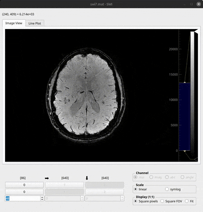

# ArrayScope

ArrayScope is a Python/Qt viewer for quickly understanding n-dimensional NumPy arrays. It is aimed at scientific and reconstruction workflows where the useful first questions are usually: *which dimensions matter, what does this slice contain, how do values change, and what happens after a small operation such as an FFT, crop, reduction, or axis change?*

The current repository is an active pre-release development line. The original lightweight viewer is still present, but the implementation now also contains a staged operation evaluator, bounded caches, progressive montage rendering, ROI/profile inspection, runtime diagnostics, and an experimental VisPy backend. See [Current state](docs/current-state.md) before treating every advanced path as production-stable.


## Start here

```python
import numpy as np
import arrayscope as asc

x = np.linspace(-5, 5, 100)
y = np.linspace(-5, 5, 100)
z = np.linspace(-5, 5, 50)
X, Y, Z = np.meshgrid(x, y, z, indexing="ij")
data = np.exp(-(X**2 + Y**2 + Z**2) / 10)

asc(data, title="3D Gaussian")
```

For a file:

```bash
python -m arrayscope data.npy
# or, after installation
arrayscope data.npy
```

By default, a call from a normal Python process opens a separate viewer process. Use `block=True` when the caller must wait for the window to close:

```python
asc(data, block=True)
```

When Qt already exists in the current process, ArrayScope avoids an unsafe fork. In IPython/Jupyter with `%gui qt`, it opens inline; without a running Qt event loop it falls back to blocking mode with a warning.

## What it does today

### Navigate and reshape the view

- Select two image axes and slice remaining dimensions.
- Enter explicit index/range selections, including cropped X/Y views.
- Flip axes and apply centered FFT shift semantics per dimension.
- Use normal image, line-profile, or tiled montage presentation.
- Preserve, fit, or restore the viewport, including true 1:1 display.

### Inspect values

- Hover pixels using the committed frame’s coordinate/value model.
- Draw ROI, line, polyline, and freehand inspection geometry.
- View live profiles and ROI statistics/histograms.
- Adjust window/level from the histogram, use automatic levels, or enter values directly.

### Transform data without replacing the source

The operation stack supports reversible, ordered steps such as crop, reverse, reductions, centered FFT/IFFT, FFT shift, and complex-axis conversion. The document keeps the source array and operation history separate; runtime optimization does not rewrite the visible operation stack.


### Work with larger views

- Visible image evaluation can run asynchronously and in chunks.
- Montage tiles are evaluated and presented progressively.
- Image, tile, profile, and reusable operation-stage caches have separate budgets.
- Runtime memory policy, latency feedback, a resource governor, and diagnostics expose why work was admitted, delayed, degraded, or refused.
- PyQtGraph is the default backend. VisPy provides experimental shader windowing and persistent tiled residency.

These mechanisms substantially improve bounded behavior, but the unified frame scheduler and backend-composition migration are not complete. The live plan is in the [roadmap](docs/roadmap.md).

### Export and load data

Video/PNG-frame export is available from a dimension action.



Supported command-line inputs include:

| Format | Suffix or input | Notes |
|---|---|---|
| NumPy | `.npy`, `.npz` | Multiple arrays open a selector |
| MATLAB | `.mat` | SciPy, with HDF5 fallback for v7.3-style files |
| HDF5 | `.h5`, `.hdf5` | Numeric datasets and common complex layouts |
| BART | `.cfl` + `.hdr` | Paired files |
| Philips | `.REC` + `.xml` | Paired files |
| NIfTI | `.nii`, `.nii.gz` | Via nibabel |
| DICOM | `.dcm` | Single-file loading via pydicom |
| DICOM directory | directory | Converted through `dcm2niix` on `PATH` |

When a container contains several datasets, ArrayScope shows a selector and highlights supported numeric arrays.


## Installation

The repository currently identifies itself as version `0.0.1` after the ArrayScope rebrand and is still being prepared for a coherent public release. For development, use the source checkout:

```bash
git clone <repository-url>
cd ArrayScope
python -m pip install -e ".[dev,vispy]"
python -m arrayscope path/to/data.npy
```

The project’s maintained environment is described by `environment.yml` and activated locally through `.envrc`/direnv:

```bash
PATH=~/miniconda3/bin:$PATH direnv exec . pytest -q tests/core
```

Core runtime dependencies include NumPy, PySide6, PyQtGraph, SciPy, h5py, pydicom, nibabel, imageio, Pillow, and psutil. VisPy is optional.

## Project documentation

- [Documentation index](docs/index.md) — the progressive entry point.
- [Mission](docs/mission.md) — product boundaries and success criteria.
- [Current state](docs/current-state.md) — what is mature, transitional, or experimental.
- [Architecture](docs/architecture.md) — ownership and invariants.
- [Roadmap](docs/roadmap.md) — current gates rather than historical phases.
- [ArrayShow and ArrayView comparison](docs/comparison.md) — product and technical lessons.
- [v28 project audit](docs/reviews/v28-project-audit.md) — findings behind the current plan.

Historical phase notes and manual checklists remain under [`docs/archive/`](docs/archive/README.md); they are evidence, not current instructions.

## Scope

ArrayScope is deliberately not a napari replacement, a MATLAB clone, a medical workstation, or a general registration/segmentation platform. It should remain quick to invoke and easy to understand while supporting serious array inspection and a bounded path for larger scientific data.

## License

MIT. See [LICENSE](LICENSE).
