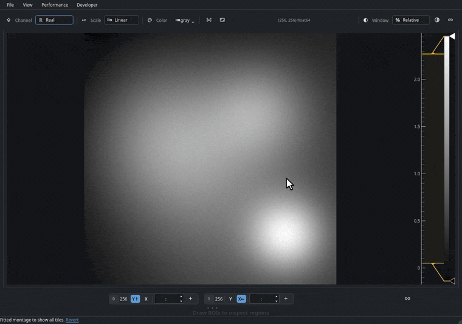
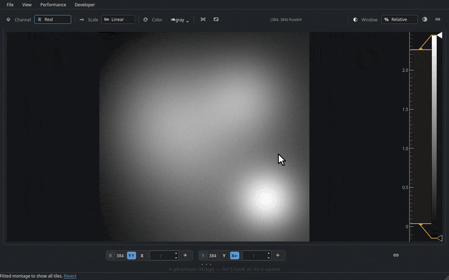
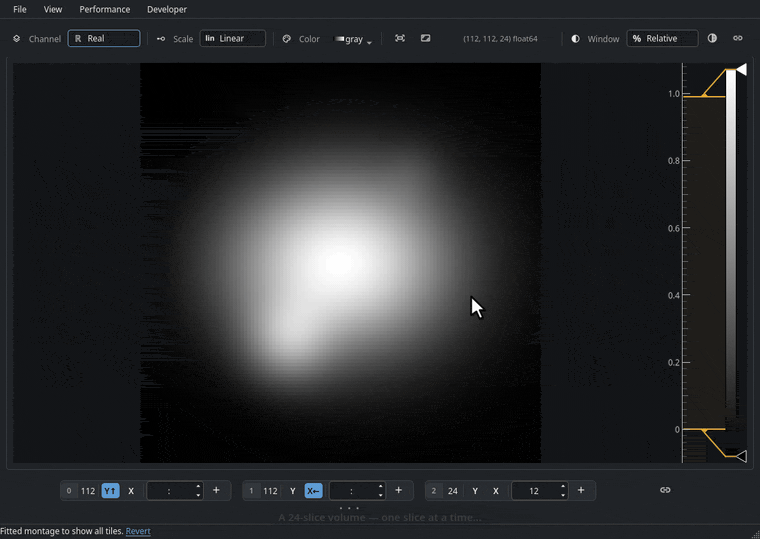

# ArrayScope

[](https://github.com/Roosted7/ArrayScope/actions/workflows/ci.yml)
[](https://codecov.io/gh/Roosted7/ArrayScope)
[](https://github.com/Roosted7/ArrayScope/actions/workflows/ci.yml)
[](LICENSE)

ArrayScope is a Python/Qt viewer for quickly understanding n-dimensional NumPy arrays. It is aimed at scientific and reconstruction workflows where the useful first questions are usually: *which dimensions matter, what does this slice contain, how do values change, and what happens after a small operation such as an FFT, crop, reduction, or axis change?*

The current repository is the ArrayScope `0.8.0` release-candidate line. It has moved well beyond the original lightweight ndslice viewer: the implementation now contains a staged operation evaluator, bounded caches, progressive montage rendering, ROI/profile inspection, runtime diagnostics, and an experimental VisPy backend. See [Current state](docs/current-state.md) before treating every advanced path as production-stable.

<picture>
  <source srcset="docs/media/showcase.avif" type="image/avif">
  
</picture>

<sub>Every demo on this page is [rendered automatically](docs/media/README.md) from a scripted walkthrough of the real application — higher-quality MP4: [showcase.mp4](docs/media/showcase.mp4).</sub>

## Start here

```python
import numpy as np
import arrayscope as asc

x = np.linspace(-5, 5, 100)
y = np.linspace(-5, 5, 100)
z = np.linspace(-5, 5, 50)
X, Y, Z = np.meshgrid(x, y, z, indexing="ij")
data = np.exp(-(X**2 + Y**2 + Z**2) / 10)

asc(data, title="3D Gaussian")
```

For a file:

```bash
python -m arrayscope data.npy
# or, after installation
arrayscope data.npy
```

By default, a call from a normal Python process opens a separate viewer process. Use `block=True` when the caller must wait for the window to close:

```python
asc(data, block=True)
```

When Qt already exists in the current process, ArrayScope avoids an unsafe fork. In IPython/Jupyter with `%gui qt`, it opens inline; without a running Qt event loop it falls back to blocking mode with a warning.

From Julia or MATLAB, dependency-free wrappers in [`wrappers/`](wrappers/README.md) hand the array to a detached viewer process through a raw, memory-mapped `.npy` file — no in-process Python bridge, no compression, and the host session stays responsive:

```julia
arrayscope(vol; name="kspace")          # Julia
```

```matlab
arrayscope(vol, 'name', 'kspace');      % MATLAB
```

See [Invocation](docs/invocation.md) for all routes and the handoff efficiency contract.

## What it does today

### Navigate and reshape the view

- Select two image axes and slice remaining dimensions.
- Enter explicit index/range selections, including cropped X/Y views.
- Flip axes and apply centered FFT shift semantics per dimension.
- Use normal image, line-profile, or tiled montage presentation.
- Preserve, fit, or restore the viewport, including true 1:1 display.

### Inspect values

- Hover pixels using the committed frame’s coordinate/value model.
- Draw ROI, line, polyline, and freehand inspection geometry.
- View live profiles and ROI statistics/histograms.
- Adjust window/level from the histogram, use automatic levels, or enter values directly.

<picture>
  <source srcset="docs/media/roi.avif" type="image/avif">
  
</picture>

<sub>[roi.mp4](docs/media/roi.mp4)</sub>

### Transform data without replacing the source

The operation stack supports reversible, ordered steps such as crop, reverse, reductions, centered FFT/IFFT, FFT shift, and complex-axis conversion. The document keeps the source array and operation history separate; runtime optimization does not rewrite the visible operation stack.

<picture>
  <source srcset="docs/media/fft.avif" type="image/avif">
  
</picture>

<sub>[fft.mp4](docs/media/fft.mp4)</sub>

### Work with larger views

- Visible image evaluation can run asynchronously and in chunks.
- Montage tiles are evaluated and presented progressively.
- Image, tile, profile, and reusable operation-stage caches have separate budgets.
- Runtime memory policy, latency feedback, a resource governor, and diagnostics expose why work was admitted, delayed, degraded, or refused.
- PyQtGraph is the default backend. VisPy provides experimental shader windowing and persistent tiled residency.

<picture>
  <source srcset="docs/media/montage.avif" type="image/avif">
  
</picture>

<sub>[montage.mp4](docs/media/montage.mp4)</sub>

These mechanisms substantially improve bounded behavior. The unified frame planner, work-graph
admission, backend composition, and the v32 render-orchestrator extraction are in place; the live
plan (token unification, backend de-duplication, hardware evidence) is in the
[roadmap](docs/roadmap.md).

### Export and load data

Video/PNG-frame export is available from a dimension action.

Supported command-line inputs include:

| Format | Suffix or input | Notes |
|---|---|---|
| NumPy | `.npy`, `.npz` | Multiple arrays open a selector |
| MATLAB | `.mat` | SciPy, with HDF5 fallback for v7.3-style files |
| HDF5 | `.h5`, `.hdf5` | Numeric datasets and common complex layouts |
| BART | `.cfl` + `.hdr` | Paired files |
| Philips | `.REC` + `.xml` | Paired files |
| NIfTI | `.nii`, `.nii.gz` | Via nibabel |
| DICOM | `.dcm` | Single-file loading via pydicom |
| DICOM directory | directory | Converted through `dcm2niix` on `PATH` |

When a container contains several datasets, ArrayScope shows a selector and highlights supported numeric arrays.


Files load asynchronously: a loading window with progress appears immediately, and for `.npy`, `.cfl`, and `.REC` the viewer opens while the file is still streaming in, with a status-bar indicator of how much of the file is available. Running `arrayscope` without arguments opens a launcher window; files can also be dropped onto any viewer window.

### Desktop integration

Register ArrayScope with your desktop shell (application menu entry, icons, and file-type associations, per-user, no root/admin needed):

```bash
arrayscope --install-desktop     # register; --uninstall-desktop reverses it
```

On Linux this installs an XDG desktop entry, MIME types, and icons under `~/.local/share`; on Windows per-user file associations and a Start Menu shortcut; on macOS an `ArrayScope.app` bundle in `~/Applications`. See [docs/desktop-integration.md](docs/desktop-integration.md).

## Installation

### Just want a viewer? (no Python required)

Standalone builds bundle everything — download, run, open files. Grab them from the [releases page](https://github.com/Roosted7/ArrayScope/releases):

- **Windows** — `ArrayScope-Setup-<version>.exe`: a conventional installer (Start Menu entry, optional desktop icon and file associations, uninstaller). A `...-portable.zip` is also available if you prefer no installation at all.
- **Linux** — `ArrayScope-<version>-x86_64.AppImage`: `chmod +x` and run; no installation, no root.
- **macOS** — `ArrayScope-<version>-macos-<arch>.dmg` (Apple Silicon and Intel): drag to Applications. The bundle is unsigned for now, so the first launch is right-click → Open.

Launching without a file shows an open dialog; `packaging/` has the build scripts and [packaging/README.md](packaging/README.md) the details.

### Using Python? (integrates with your environment)

Once published on PyPI, any of the standard routes work — pick the one matching how you manage environments:

```bash
pip install arrayscope        # into the active environment (importable + CLI)
pipx install arrayscope       # isolated CLI tool on your PATH
uv tool install arrayscope    # same idea, via uv
```

The Python install is the full-featured route: `from arrayscope import arrayscope as asc` in scripts and notebooks, plus the `arrayscope` CLI.

### From source

ArrayScope identifies this release-candidate baseline as version `0.8.0`. Until the first PyPI upload is published, install from the dedicated ArrayScope source checkout:

```bash
git clone <repository-url>
cd ArrayScope
python -m pip install -e ".[dev,vispy]"
python -m arrayscope path/to/data.npy
```

The project’s maintained environment is described by `environment.yml` and activated locally through `.envrc`/direnv:

```bash
PATH=~/miniconda3/bin:$PATH direnv exec . pytest -q tests/core
```

The suite runs in parallel by default (`pytest-xdist`); append `-n 0` to run serially when debugging. See [testing strategy](docs/testing/strategy.md#parallel-execution) for details.

Pull requests run a dedicated coverage job in CI. To reproduce it locally:

```bash
PATH=~/miniconda3/bin:$PATH direnv exec . pytest tests/ -q --cov=arrayscope --cov-report=term-missing:skip-covered --cov-report=xml
```

Core runtime dependencies include NumPy, PySide6, PyQtGraph, SciPy, h5py, pydicom, nibabel, imageio, Pillow, and psutil. VisPy is optional.

## Project documentation

- [Documentation index](docs/index.md) — the progressive entry point.
- [Mission](docs/mission.md) — product boundaries and success criteria.
- [Current state](docs/current-state.md) — what is mature, transitional, or experimental.
- [Architecture](docs/architecture.md) — ownership and invariants.
- [Roadmap](docs/roadmap.md) — current gates rather than historical phases.
- [ArrayShow and ArrayView comparison](docs/comparison.md) — product and technical lessons.
- [v32 composition audit](docs/reviews/v32-composition-audit.md) — findings behind the current plan.

Historical phase notes and manual checklists remain under [`docs/archive/`](docs/archive/README.md); they are evidence, not current instructions.

## Scope

ArrayScope is deliberately not a napari replacement, a MATLAB clone, a medical workstation, or a general registration/segmentation platform. It should remain quick to invoke and easy to understand while supporting serious array inspection and a bounded path for larger scientific data.

## License

MIT. See [LICENSE](LICENSE).
